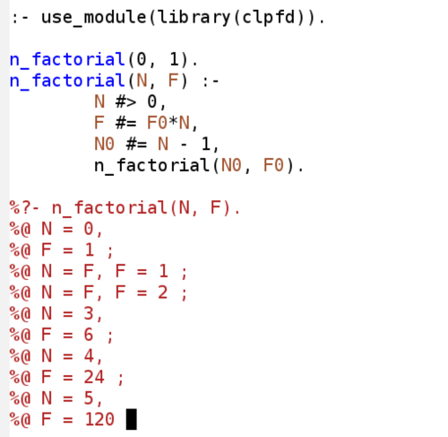

# Introduction

*ediprolog* lets you interact with SWI-Prolog in all Emacs buffers.
You can consult Prolog programs and evaluate embedded queries.

**Project page**:

[**https://www.metalevel.at/ediprolog/**](https://www.metalevel.at/ediprolog/)

See also [PceProlog](https://www.metalevel.at/pceprolog/).

# Installation

Copy [ediprolog.el](ediprolog.el) to your `load-path` and add to your `.emacs`:

    (require 'ediprolog)
    (global-set-key [f10] 'ediprolog-dwim)

Restart Emacs and customize ediprolog with

    M-x customize-group RET ediprolog RET

# Screenshot

Here is a sample interaction, using
[CLP(FD)&nbsp;constraints](https://www.metalevel.at/prolog/clpfd) to
relate a number to its factorial:

# Usage

The central function is `ediprolog-dwim` (Do What I Mean), which is
bound to F10 by the snippet above. Depending on the content at
point, `ediprolog-dwim` does the "appropriate" thing: If point is
on a *query*, F10 sends the query to a Prolog process, and you
interact with the process in the current buffer as on a terminal.
Queries start with "?-" or ":-", possibly preceded by "%" and
whitespace. An example of a query is:

    %?- member(X, [a,b,c]).

If you press F10 when point is on that query, you get:

    %?- member(X, [a,b,c]).
    %@ X = a ;
    %@ X = b ;
    %@ X = c ;
    %@ false.

When waiting for output of the Prolog process, you can press C-g to
unblock Emacs and continue with other work. To resume interaction
with the Prolog process, use **M-x&nbsp;ediprolog-toplevel&nbsp;RET**.

If you press F10 when point is *not* on a query, the buffer content is
consulted in the Prolog process, and point is moved to the first error
(if any). You do&nbsp;*not* need to *save* the file beforehand, since
the *buffer&nbsp;content* (not the file) is consulted.

For convenience, the most recent interactions with the Prolog
process are logged in the buffer `*ediprolog-history*`.

Use **M-x ediprolog-localize RET** to make any Prolog process started
in the current buffer buffer-local. This way, you can run distinct
processes simultaneously. Revert with
**M-x&nbsp;ediprolog-unlocalize&nbsp;RET**.

`ediprolog-dwim` with prefix arguments has special meanings:

| Key Sequence |   Meaning                                                |
|--------------|----------------------------------------------------------|
|  C-0 F10     |   kill Prolog process                                    |
|  C-1 F10     |   always consult buffer (even when point is on a query)  |
|  C-2 F10     |   always consult buffer, using a new process             |
|  C-7 F10     |   equivalent to `ediprolog-toplevel'                     |
|  C-u F10     |   first consult buffer, then evaluate query (if any)     |
|  C-u C-u F10 |   like C-u F10, with a new process                       |

Tested with SWI-Prolog 5.6, 6.6 and 7.2 + Emacs 21.2, 22.3, 23.1 and 24.3.
